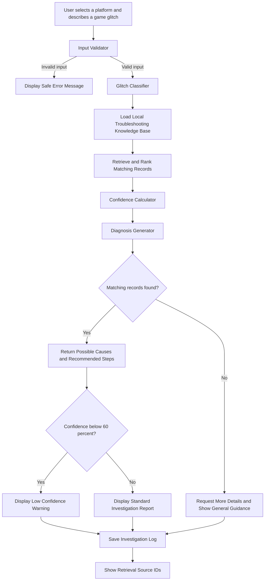

# Game Glitch Investigator AI

## Project Summary

Game Glitch Investigator AI is a Streamlit application that helps users diagnose common video game problems. A user selects a gaming platform and describes a glitch, and the system classifies the issue, retrieves matching troubleshooting records, calculates a confidence score, and returns possible causes and safe recommended steps.

This project matters because game problems are often described in different ways, and users may not know where to begin troubleshooting. The application organizes that process into a clear, repeatable workflow while avoiding destructive actions such as deleting files or changing system settings automatically.

## Original Module Project

The original project was named **GameGlitch**. It was a number-guessing game built with Python and Streamlit that demonstrated user input handling, difficulty levels, scoring, conditional logic, and automated tests.

For this final project, I preserved the original application as `legacy_game.py`. I then redesigned the repository into an AI-assisted troubleshooting system that uses retrieval, classification, confidence scoring, logging, guardrails, and reliability testing.

## Main Features

- Streamlit user interface
- Platform selection
- Game-glitch description input
- Input validation
- Glitch classification
- Local troubleshooting knowledge base
- Retrieval and ranking of matching records
- Confidence scoring
- Possible-cause generation
- Ordered troubleshooting recommendations
- Low-confidence fallback guidance
- Investigation logging
- Privacy and safety warnings
- Automated reliability tests

## AI Feature: Retrieval-Based Troubleshooting

The main AI feature is a retrieval-based troubleshooting workflow.

The system searches the local knowledge base in:

```text
data/glitch_knowledge.json
```

Each record contains:

- A glitch category
- Supported platforms
- Matching keywords
- A possible cause
- Recommended troubleshooting steps
- A risk level

The user's description is compared with these records. Matches are ranked using keyword, category, and platform information. The retrieved records are then used directly to build the diagnosis and recommendations.

The retrieval feature is integrated into the main application. The system does not simply display stored data beside a generic response. The retrieved records determine the possible causes, recommended steps, confidence score, and source IDs shown in the final report.

## Supported Issue Categories

The current system supports:

- Performance problems
- Crashing
- Graphics problems
- Network problems
- Audio problems
- Save-data problems
- Controller problems
- Unknown or unsupported issues

## Architecture Overview

The Mermaid architecture source is stored in:

```text
diagrams/architecture.mmd
```

The workflow is:

1. The user selects a platform and describes a game glitch.
2. The input validator checks whether the description contains enough information.
3. The classifier identifies the most likely issue category.
4. The retriever loads the local troubleshooting knowledge base.
5. Matching records are ranked using platform, category, and keyword matches.
6. The confidence calculator estimates the strength of the match.
7. The diagnosis generator creates possible causes and recommended steps.
8. Low-confidence cases receive a warning or general guidance.
9. Completed investigations are saved to a structured log.
10. The interface displays the knowledge-base source IDs used.



## Project Structure

```text
applied-ai-system-final/
├── app.py
├── glitch_retriever.py
├── legacy_game.py
├── logic_utils.py
├── README.md
├── model_card.md
├── requirements.txt
├── test_results.txt
├── ai_interactions.md
├── reflection.md
├── assets/
├── data/
│   └── glitch_knowledge.json
├── diagrams/
│   └── architecture.mmd
├── logs/
│   ├── .gitkeep
│   └── investigations.jsonl
└── tests/
    ├── test_game_logic.py
    └── test_glitch_retriever.py
```

## Setup Instructions

### 1. Clone the repository

```bash
git clone https://github.com/wafa-mz/applied-ai-system-final.git
```

### 2. Enter the project folder

```bash
cd applied-ai-system-final
```

### 3. Install the required packages

```bash
python3 -m pip install -r requirements.txt
```

The main dependencies are:

```text
streamlit==1.58.0
pytest
```

### 4. Run the application

```bash
python3 -m streamlit run app.py
```

Streamlit should open the application in a browser. The local address will usually be:

```text
http://localhost:8501
```

### 5. Stop the application

Return to the terminal and press:

```text
Control + C
```

## How to Use the Application

1. Select a gaming platform.
2. Enter a detailed description of the glitch.
3. Click **Investigate Glitch**.
4. Review the category and confidence score.
5. Read the possible causes.
6. Follow the recommended steps carefully.
7. Open **Retrieval details** to see which knowledge-base records were used.

Users should not enter passwords, account credentials, private server addresses, or other sensitive information.

## Sample Interactions

### Example 1: Game crashes during launch

#### Input

```text
Platform: PC

Description:
My game crashes every time I launch it and closes to the desktop.
```

#### Output

```text
Investigation Report

Issue category: Crashing
Confidence: 100%

Possible cause:
The game files may be corrupted or an update may be missing.

Recommended steps:
1. Restart the game and gaming device.
2. Install available game and system updates.
3. Verify the game files through the official launcher if available.
4. Temporarily disable unsupported modifications.

Knowledge-base records used: [2]
```

### Example 2: Multiplayer disconnection

#### Input

```text
Platform: PlayStation

Description:
I keep disconnecting from multiplayer matches and getting a timeout.
```

#### Output

```text
Investigation Report

Issue category: Network
Confidence: 100%

Possible cause:
The network connection may be unstable or the game server may be unavailable.

Recommended steps:
1. Check whether the game servers are online.
2. Restart the game and router.
3. Use a wired connection when possible.
4. Pause downloads and streaming on other devices.

Knowledge-base records used: [4]
```

### Example 3: Unsupported or unclear problem

#### Input

```text
Platform: PC

Description:
A strange symbol appears only after opening a hidden menu in the game.
```

#### Output

```text
Investigation Report

Issue category: Unknown
Confidence: 20%

Possible causes:
No matching cause was found.

Recommended steps:
1. Provide the exact error message.
2. Include the game title and platform.
3. Explain when the problem started.
4. Describe any recent updates or modifications.

Warning:
There was not enough information to provide a reliable diagnosis.

Knowledge-base records used: []
```

## Guardrail Examples

### Empty input

#### Input

```text
Platform: PC
Description:
```

#### Result

```text
Please describe the game glitch.
```

The system rejects the input and does not attempt to produce a diagnosis.

### Description that is too short

#### Input

```text
Platform: PC
Description: It lags
```

#### Result

```text
Please provide more details about the glitch.
```

This guardrail helps prevent vague or misleading diagnoses.

## Logging

Completed investigations are written to:

```text
logs/investigations.jsonl
```

Each entry can include:

- Timestamp
- Platform
- User description
- Completion status
- Predicted category
- Confidence score
- Retrieved knowledge-base source IDs

Example log structure:

```json
{
  "timestamp": "2026-08-04T21:42:00",
  "platform": "PC",
  "description": "My game crashes every time I launch it and closes to the desktop.",
  "status": "complete",
  "category": "crashing",
  "confidence": 1.0,
  "retrieved_source_ids": [2]
}
```

## Reliability and Testing

The system uses automated tests with `pytest`.

Run the new glitch-investigation tests with:

```bash
python3 -m pytest tests/test_glitch_retriever.py -v
```

Observed result:

```text
collected 10 items
10 passed in 0.08s
```

Run the complete repository test suite with:

```bash
python3 -m pytest -v
```

Observed result:

```text
collected 23 items
23 passed in 0.10s
```

The complete output is committed in:

```text
test_results.txt
```

### Testing Summary

All 10 new reliability tests passed. They verified:

- Knowledge-base loading
- Crashing classification
- Network classification
- Audio classification
- Controller retrieval
- Complete diagnosis generation
- Empty-input rejection
- Short-input rejection
- Unknown-issue fallback behavior
- Confidence-score boundaries

The complete project suite passed 23 out of 23 tests.

The system performed best when descriptions contained specific symptoms such as `crash`, `launch`, `disconnect`, `timeout`, `audio`, or `controller`. Vague or unsupported descriptions produced lower confidence and general fallback guidance instead of pretending to know the answer.

## Design Decisions

### Local JSON knowledge base

I used a local JSON file because it is transparent, reproducible, and easy to inspect. A future employer or reviewer can see exactly which troubleshooting records influence the output.

### Separate retrieval module

The retrieval, classification, confidence, and diagnosis logic are placed in `glitch_retriever.py`. This keeps the Streamlit interface separate from the core system logic and makes the functions easier to test.

### Confidence scoring

The application displays a confidence score instead of presenting every answer as certain. Low-confidence results receive a warning and more general guidance.

### Safe recommendations

The knowledge base prioritizes low-risk troubleshooting steps. The system does not automatically delete files, change settings, download software, or access the user's device.

### Preserve the original project

The original application was retained as `legacy_game.py`. This shows how the final project evolved from the earlier module work without deleting the original implementation.

## Trade-Offs

The system uses keyword matching instead of a large embedding model or external API. This makes the project easy to run, inexpensive, private, and reproducible, but it also limits semantic understanding.

The local knowledge base is small and manually created. This improves transparency but means the system may not recognize rare, game-specific, newly released, or unusually worded problems.

The confidence score measures retrieval strength. It should not be interpreted as a guaranteed probability that the diagnosis is correct.

## Limitations

- The system cannot inspect the user's gaming device.
- It cannot read game files, system logs, or network diagnostics.
- It may miss synonyms that are not included in the knowledge base.
- It does not currently search official support websites.
- It cannot confirm whether a recommended step solved the problem.
- It may provide general guidance for problems that require professional repair.
- Its knowledge is limited to the records in the local JSON file.

For responsible-AI details, biases, misuse risks, testing observations, and AI-collaboration reflection, see:

```text
model_card.md
```

## Reflection

This project taught me that an applied AI system requires more than producing an answer. It needs organized data, validation, confidence handling, logging, tests, documentation, and clear limitations.

I also learned that retrieval quality depends heavily on the words used in the user's description and the coverage of the knowledge base. Testing vague and unsupported inputs helped me improve the guardrails and fallback behavior instead of allowing the system to return an overconfident answer.

## Reproducible Execution Evidence

### Dependency installation

```bash
python3 -m pip install -r requirements.txt
```

Observed output:

```text
Requirement already satisfied: streamlit==1.58.0
Requirement already satisfied: pytest
```

### Streamlit version

```bash
python3 -m streamlit --version
```

Observed output:

```text
Streamlit, version 1.58.0
```

### Application launch

```bash
python3 -m streamlit run app.py
```

Observed output:

```text
You can now view your Streamlit app in your browser.

Local URL: http://localhost:8501
```

### Complete test suite

```bash
python3 -m pytest -v
```

Observed output:

```text
collected 23 items
23 passed in 0.10s
```

## Responsible AI Documentation

The required responsible-AI reflection is located in:

```text
model_card.md
```

It discusses:

- System limitations and biases
- Possible misuse
- Prevention measures
- Reliability-testing observations
- Collaboration with AI
- One helpful AI suggestion
- One flawed AI suggestion
- Responsible-use guidance
- Future improvements

## Portfolio Reflection

This project shows that I can take an earlier Python application and redesign it into a structured applied AI system. I integrated retrieval, classification, confidence scoring, logging, guardrails, automated testing, architecture documentation, and a professional Streamlit interface.

It also demonstrates that I understand the importance of transparent system behavior, reproducible testing, human review, and responsible communication about AI limitations.

## Repository

GitHub repository:

```text
https://github.com/wafa-mz/applied-ai-system-final
```